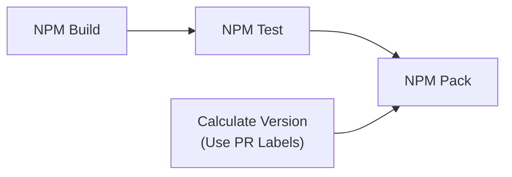
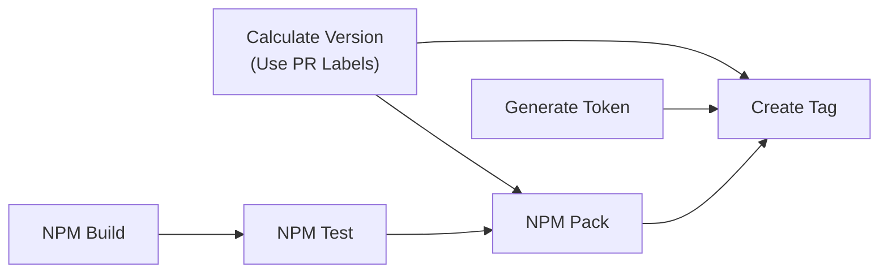
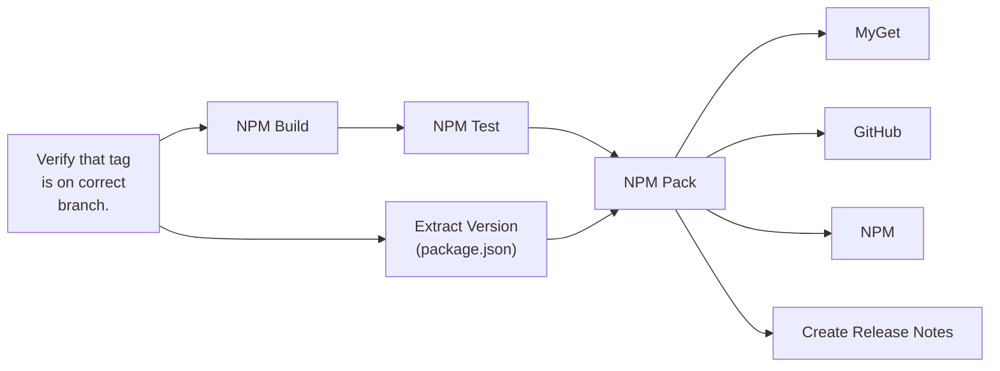

# Reusable GitHub Actions Workflows

Unless noted in the YAML, these are all licensed under the root folder's MIT license.

- [Reusable GitHub Actions Workflows](#reusable-github-actions-workflows)
- [GitHub Actions](#github-actions)
  - [npm-create-github-release-with-artifact.yml](#npm-create-github-release-with-artifactyml)
  - [verify-tag-is-on-allowed-branch.yml](#verify-tag-is-on-allowed-branchyml)
- [GitHub Tokens](#github-tokens)
  - [generate-github-token-from-github-app.yml](#generate-github-token-from-github-appyml)
- [NPM](#npm)
  - [Sequence Diagrams](#sequence-diagrams)
    - [PR Build Sequence](#pr-build-sequence)
    - [PR Merge Sequence](#pr-merge-sequence)
    - [Release on Tag Sequence](#release-on-tag-sequence)
  - [calculate-version-with-npm-version-using-pr-labels.yml](#calculate-version-with-npm-version-using-pr-labelsyml)
  - [extract-version-from-npm-package-json.yml](#extract-version-from-npm-package-jsonyml)
  - [npm-build.yml](#npm-buildyml)
  - [npm-create-version-tag.yml](#npm-create-version-tagyml)
  - [npm-pack.yml](#npm-packyml)
  - [npm-packages-pr-build.yml](#npm-packages-pr-buildyml)
  - [npm-packages-pr-create-tag.yml](#npm-packages-pr-create-tagyml)
  - [npm-packages-release-on-tag.yml](#npm-packages-release-on-tagyml)
  - [npm-publish-to-github-packages.yml](#npm-publish-to-github-packagesyml)
  - [npm-publish-to-myget.yml](#npm-publish-to-mygetyml)
  - [npm-test.yml](#npm-testyml)

# GitHub Actions

## npm-create-github-release-with-artifact.yml

Create a GitHub release using an existing tag, then attach a file from the runner artifact to the release.  This only supports a single artifact file.

## verify-tag-is-on-allowed-branch.yml

Given a list of branch names, verifies that the tag exists on one or more of those branch names.  This helps guard against someone pushing a tag to another branch on the repo in cases where you can't restrict who can push tags.  Or you just want to guard against someone pushing a version tag to the wrong branch.

# GitHub Tokens

## generate-github-token-from-github-app.yml

Generates a GITHUB_TOKEN from a GitHub Application registered for the organization.  The list of requested permissions can be customized.

Notes: 

- Because of how GitHub takes efforts to protect GitHub Tokens from being passed between jobs, we have to encrypt/obfuscate the token.  Doing this in a separate job is still useful because it limits exposure of the GitHub App's private key to just this job runner.  The other job steps which consume the token have no way to request a higher level set of permissions.

- As late as Aug 2023, GitHub App tokens can NOT be used to access GitHub Packages.

# NPM

Scripts for executing the NPM build / test / pack cycle.  These workflows are opinionated in that they run the cycle's parts in separate GitHub Action jobs.  Doing it this way will increase your GitHub Actions minutes consumption rate but provides the ability to do things in parallel and quickly see which part of the build failed.

We may provide consolidated variants in the future which use fewer separate jobs.

## Sequence Diagrams

Each box is a separate job within the GitHub Actions workflow.

### PR Build Sequence

### PR Merge Sequence

### Release on Tag Sequence

## calculate-version-with-npm-version-using-pr-labels.yml

Calculate the version by starting with an NPM package.json file and then looking at labels applied to the pull request (PR).  Once the version is calculated this workflow returns ouput variables that can be used in later jobs.  There is support for package.json files that are named otherwise or do not exist at the root of the repository.

## extract-version-from-npm-package-json.yml

Extract the version from the NPM package.json file.  Once the version is extracted this workflow returns ouput variables that can be used in later jobs.  There is support for package.json files that are named otherwise or do not exist at the root of the repository.

## npm-build.yml

Execute '`npm run build`' against the package.json file.  There is support for package.json files that are named otherwise or do not exist at the root of the repository.  This workflow *only* runs the build script.

At the end of the job, it bundles up the entire workspace into a `.tgz` file for use in later jobs.  This reduces the amount of time needed to run tests, security scans, or the 'npm pack' command later on.

The disadvantage of separate jobs is cost.  You are billed a minimum of one minute of runtime for every job in a workflow.  But the advantage is the ability to perform job steps in parallel (such as tests) and process isolation.

## npm-create-version-tag.yml

Executes `npm version` in a way that creates a git commit and also tags that commit. The only file that should change during this step is the 'package.json' file.  The commit and tag are then pushed to the main git repo for future use by other PRs.

There is support for package.json files that are named otherwise or do not exist at the root of the repository.

Requires the use of a GitHub App token in order to perform the push.  This is because we need to bypass any branch protection and/or rulesets on the branch.

## npm-pack.yml

Execute `npm pack` against the package.json file. There is support for package.json files that are named otherwise or do not exist at the root of the repository.  This workflow *only* runs the pack command.

The resulting artifact (a `.tgz` file) will be uploaded to the workflow run and output variables provide information on the archive name (`artifact_name`) and file path (`artifact_file_path`).

## npm-packages-pr-build.yml

Designed to be called when a PR is opened against a branch in the repository. This operates with a read-only GitHub Token for safety. See the [PR Build Sequence](#pr-build-sequence) diagram.

## npm-packages-pr-create-tag.yml

Designed to be called when a PR is merged against a branch in the repository. It creates a new commit and tag using the a GitHub App token upon completion. See the [PR Merge Sequence](#pr-merge-sequence) diagram.

## npm-packages-release-on-tag.yml

Designed to be called when a tag is created on a specific branch in the repository.  Tags which are not created on the correct branch will result in workflow failure.  See the [Release on Tag Sequence](#release-on-tag-sequence) diagram.

## npm-publish-to-github-packages.yml

Publish the NPM package to the GitHub Packages registry.  The artifact (`.tgz`) file is pulled from the artifacts on the workflow run.

## npm-publish-to-myget.yml

Publish the NPM package to the MyGet NPM registry.  The artifact (`.tgz`) file is pulled from the artifacts on the workflow run.

## npm-test.yml

Execute '`npm run test`' against the package.json file.  There is support for package.json files that are named otherwise or do not exist at the root of the repository.  This workflow *only* runs the test script.

Note: This restores the workspace created in the [npm-build.yml](#npm-buildyml) job before executing the test script.
